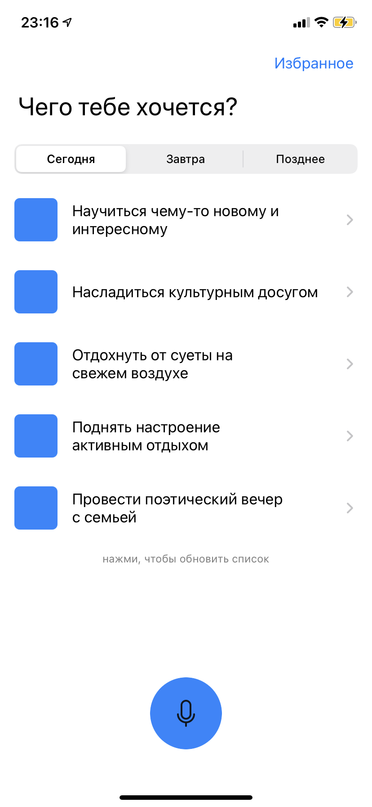
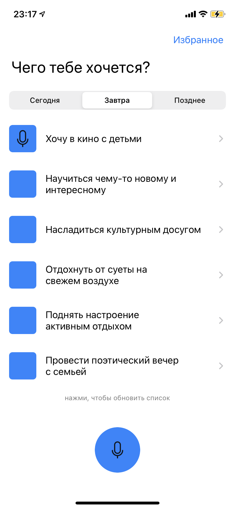
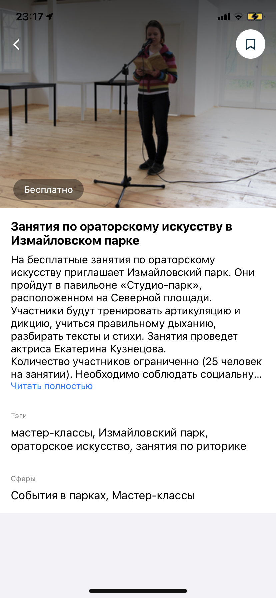
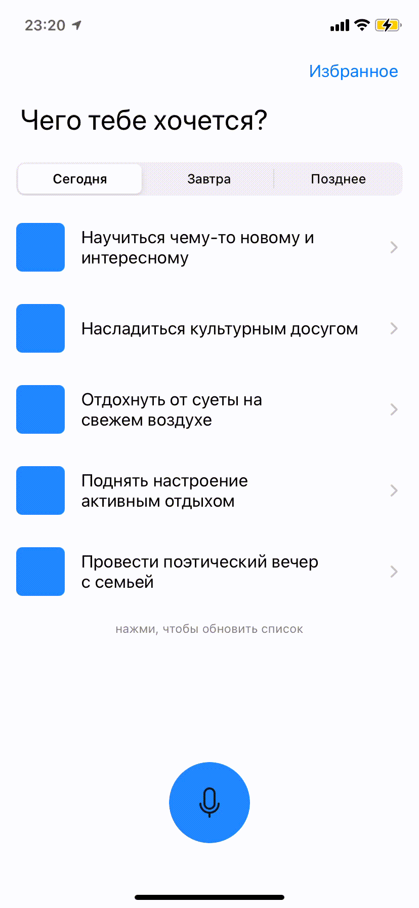

# MOS.RU
Moscow City Hack

## Задача 
Основная задача – разработать функционал (модель или макет сервиса) по подбору
и планированию мероприятий в городском мобильном приложении «Моя Москва».
В рамках сервиса пользователю должна быть предоставлена возможность
подобрать одно или несколько мероприятий, проходящих в городе Москве, а также
спланировать досуг для самых разных категорий пользователей (например, отдых
всей семьи, ребёнка или одного взрослого).

## Фичи
- [x] Голосовой ввод
- [x] Поддержка темной темы
- [x] Возможность добавлять в избранное

## 
     
